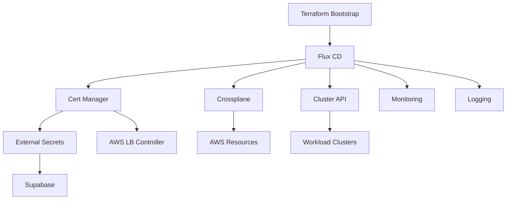

# Cloud Seed Pattern - Architecture Overview

## Repository Purpose
This repository implements a production-grade Kubernetes platform using GitOps principles for multi-cluster, multi-account deployments on AWS.

## Core Architecture Components

### 1. Infrastructure Bootstrapping (Terraform)
- **Location**: `components/tf_initialSeedCluster/`
- **Purpose**: Creates the initial management EKS cluster with IRSA
- **Key Features**:
  - EKS cluster with managed node groups
  - IRSA roles for all major components
  - Outputs stored in ConfigMap for Flux variable substitution

### 2. GitOps Engine (Flux CD)
- **Bootstrap**: `scripts/bootstrap-flux.sh`
- **Configuration**: Watches entire repo except Terraform directories
- **Key Patterns**:
  - Kustomizations for component deployment
  - Variable substitution from terraform-outputs ConfigMap
  - Dependency management between components

### 3. Cloud Infrastructure (Crossplane)
- **Location**: `components/helmrelease/crossplane/`
- **Authentication**: IRSA with cross-account assume roles
- **Key Resources**:
  - VPC compositions for network creation
  - ProviderConfigs for multi-account access
  - Managed resources for AWS services

### 4. Cluster Management (Cluster API)
- **Location**: `components/helmrelease/cluster-api/`
- **Purpose**: Lifecycle management of workload clusters
- **Providers**: AWS provider for EKS cluster creation

### 5. Multi-Account Management
- **Terraform Module**: `components/tf_accounts/`
- **Pattern**: 
  1. Create accounts via Terraform
  2. Auto-generate ConfigMaps with account details
  3. Reference in Crossplane ProviderConfigs
  4. Use account alias in resource specifications

## Directory Structure Patterns

### Components Directory
```
components/
├── helmrelease/          # Helm-based applications
├── kustomizations/       # Reusable Kustomize bases
├── tf_accounts/          # Account management
└── tf_initialSeedCluster/ # Bootstrap infrastructure
```

### Clusters Directory
```
clusters/
├── _template/            # Template for new clusters
├── management/          
│   ├── primary/         # Main management cluster
│   └── prim/           # Alternative/legacy setup
└── <account-name>/      # Per-account cluster configs
```

## Key Design Decisions

1. **No Static Credentials**: All authentication via IRSA and temporary tokens
2. **GitOps Everything**: All changes through Git, no direct kubectl apply
3. **Account Isolation**: Each environment in separate AWS account
4. **Variable Substitution**: Dynamic values injected via ConfigMaps
5. **Dependency Management**: Explicit dependencies in Flux Kustomizations

## Component Dependencies



## IRSA Integration Points

1. **AWS Load Balancer Controller**: Creates ALB/NLB resources
2. **External Secrets Operator**: Fetches secrets from AWS Secrets Manager
3. **EBS CSI Driver**: Manages EBS volumes for persistent storage
4. **Crossplane**: Provisions AWS resources across accounts
5. **Cluster API**: Creates and manages EKS clusters

## Common Workflows

1. **New Environment**: Use `scripts/gitops-account-setup.sh`
2. **New Cluster**: Use `scripts/gitops-create-cluster.sh`
3. **Local Development**: Use `scripts/dev-workflow.sh`
4. **Component Updates**: Modify version in HelmRelease, commit, push