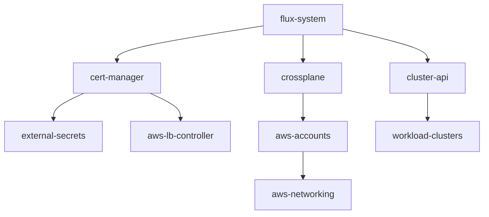

# GitOps Workflows and Best Practices

## Core GitOps Principles

### 1. Declarative Everything
- All infrastructure and applications defined in Git
- Current state always matches Git repository
- No imperative commands in production

### 2. Git as Single Source of Truth
- All changes through pull requests
- Audit trail via Git history
- Rollback through Git revert

### 3. Automated Reconciliation
- Flux continuously syncs Git → Cluster
- Self-healing on drift detection
- Automated error recovery

## Development Workflows

### Local Development Workflow
The `dev-workflow.sh` script provides isolated development:

```bash
# Start development session
./scripts/dev-workflow.sh start "implementing feature X"

# Workflow:
# 1. Creates feature branch
# 2. Pauses Flux reconciliation
# 3. Allows direct kubectl apply for testing
# 4. Checkpoints progress with local commits
# 5. Squashes into clean commit when done
# 6. Resumes Flux automation

# Key commands during session:
./scripts/dev-workflow.sh test <manifest>   # Test changes
./scripts/dev-workflow.sh checkpoint "msg"   # Save progress
./scripts/dev-workflow.sh diff <manifest>    # Preview changes
./scripts/dev-workflow.sh finish "msg"       # Complete work
```

### GitOps PR Workflow
For production changes:

```bash
# 1. Create feature branch
git checkout -b feature/add-component

# 2. Make changes
vim clusters/management/primary/new-component.yaml

# 3. Test with Flux locally
flux build kustomization flux-system \
  --path clusters/management/primary

# 4. Commit and push
git add .
git commit -m "Add new component"
git push -u origin feature/add-component

# 5. Create PR for review
gh pr create --title "Add new component" \
  --body "Description of changes"

# 6. After merge, Flux auto-deploys
```

## Flux Patterns

### Kustomization Structure
```yaml
apiVersion: kustomize.toolkit.fluxcd.io/v1
kind: Kustomization
metadata:
  name: apps
  namespace: flux-system
spec:
  # Source configuration
  sourceRef:
    kind: GitRepository
    name: flux-system
  
  # Path in repository
  path: ./clusters/management/primary
  
  # Reconciliation settings
  interval: 10m
  timeout: 5m
  retryInterval: 2m
  
  # Garbage collection
  prune: true
  
  # Health checks
  wait: true
  
  # Dependencies
  dependsOn:
    - name: infrastructure
  
  # Variable substitution
  postBuild:
    substituteFrom:
      - kind: ConfigMap
        name: cluster-config
```

### Dependency Management


### Multi-Stage Deployments
```yaml
# Stage 1: Core Infrastructure
apiVersion: kustomize.toolkit.fluxcd.io/v1
kind: Kustomization
metadata:
  name: infrastructure
spec:
  path: ./infrastructure
  
# Stage 2: Platform Services  
---
apiVersion: kustomize.toolkit.fluxcd.io/v1
kind: Kustomization
metadata:
  name: platform
spec:
  path: ./platform
  dependsOn:
    - name: infrastructure
    
# Stage 3: Applications
---
apiVersion: kustomize.toolkit.fluxcd.io/v1
kind: Kustomization
metadata:
  name: apps
spec:
  path: ./apps
  dependsOn:
    - name: platform
```

## Secret Management

### External Secrets Pattern
```yaml
# 1. SecretStore references AWS Secrets Manager
apiVersion: external-secrets.io/v1beta1
kind: SecretStore
metadata:
  name: aws-secrets
spec:
  provider:
    aws:
      service: SecretsManager
      region: us-east-1
      auth:
        jwt:
          serviceAccountRef:
            name: external-secrets

# 2. ExternalSecret syncs to K8s Secret
---
apiVersion: external-secrets.io/v1beta1
kind: ExternalSecret
metadata:
  name: app-secrets
spec:
  secretStoreRef:
    name: aws-secrets
  target:
    name: app-secrets
  data:
    - secretKey: api-key
      remoteRef:
        key: prod/app/api-key
```

### Sealed Secrets Alternative
```bash
# Encrypt secret locally
echo -n "secret-value" | kubeseal \
  --raw --from-file=/dev/stdin \
  --namespace default \
  --name mysecret > sealed-secret.yaml

# Commit encrypted secret
git add sealed-secret.yaml
git commit -m "Add sealed secret"
```

## Monitoring GitOps

### Flux Monitoring Commands
```bash
# Overall health check
flux check

# Watch all resources
flux get all -A

# Monitor specific namespace
flux get kustomizations -n flux-system

# Real-time events
flux events --watch

# Trace resource dependencies
flux trace <resource>

# Force reconciliation
flux reconcile source git flux-system
flux reconcile kustomization apps
```

### Alerting Configuration
```yaml
apiVersion: notification.toolkit.fluxcd.io/v1beta1
kind: Alert
metadata:
  name: flux-system
  namespace: flux-system
spec:
  providerRef:
    name: slack
  eventSeverity: info
  eventSources:
    - kind: GitRepository
      name: '*'
    - kind: Kustomization
      name: '*'
  summary: 'Flux event: {{ .Kind }}/{{ .Name }}'
```

## Rollback Strategies

### Method 1: Git Revert
```bash
# Revert the problematic commit
git revert <commit-hash>
git push

# Flux automatically applies the revert
```

### Method 2: Flux Suspend
```bash
# Suspend reconciliation
flux suspend kustomization apps

# Fix issues manually
kubectl apply -f fixed-manifest.yaml

# Resume when ready
flux resume kustomization apps
```

### Method 3: Branch Rollback
```bash
# Update Flux to track previous branch
./scripts/update-flux-branch.sh stable-release

# Or edit directly
kubectl edit gitrepository flux-system -n flux-system
# Change spec.ref.branch
```

## Best Practices

### 1. Repository Structure
- Separate infrastructure from applications
- Use consistent directory hierarchy
- Group by environment/account
- Template new environments

### 2. Change Management
- Small, focused commits
- Descriptive commit messages
- Test in dev environment first
- Use PR reviews for production

### 3. Resource Organization
- Namespace per application/team
- Labels for ownership
- Consistent naming conventions
- Resource quotas and limits

### 4. Security
- No secrets in Git
- Use External Secrets or Sealed Secrets
- RBAC for namespace isolation
- Network policies for segmentation

### 5. Observability
- Monitor Flux metrics
- Alert on reconciliation failures
- Log aggregation for troubleshooting
- Distributed tracing for complex apps

## Common Issues and Solutions

### Issue: Flux Not Syncing
```bash
# Check Git connectivity
flux get sources git

# Verify branch/tag
kubectl get gitrepository flux-system -o yaml

# Check for errors
flux logs --kind=GitRepository --name=flux-system
```

### Issue: Dependency Deadlock
```bash
# List dependencies
flux get kustomizations --show-graph

# Suspend problematic resource
flux suspend kustomization <name>

# Fix and resume
flux resume kustomization <name>
```

### Issue: Resource Conflicts
```yaml
# Use server-side apply
apiVersion: kustomize.toolkit.fluxcd.io/v1
kind: Kustomization
spec:
  force: true  # Use with caution
```

### Issue: Slow Reconciliation
```yaml
# Adjust intervals
spec:
  interval: 5m      # More frequent
  timeout: 10m      # Longer timeout
  retryInterval: 1m # Faster retries
```